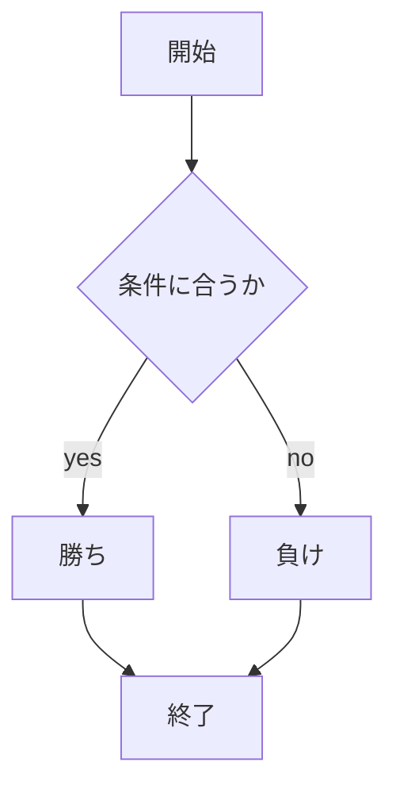
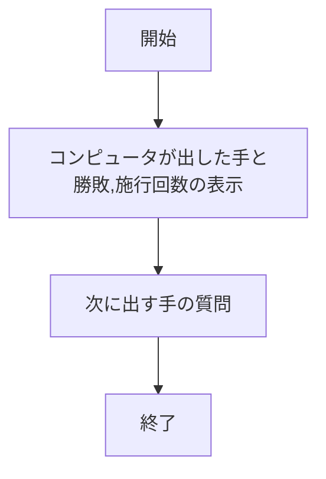

# webpro_06
2024_10_29

## このプログラムについて
このプログラムは,じゃんけんをコンピュータに対して行うものである.自分の手を入力することで,相手のランダムに出される手が返って,勝ち負けおよび施行回数が表示される
## ファイル一覧
ファイル名 | 説明
-|-
app5.js | プログラム本体
public/janken.html | じゃんけんの開始画面
views/janken.ejs | じゃんけんのテンプレートファイル

1. app5.jsを起動する
1. Webブラウザでlocalhost:8080/public/janken.htmlにアクセスする
1. 自分の手を入力する
## app5.js

## janken.ejs

