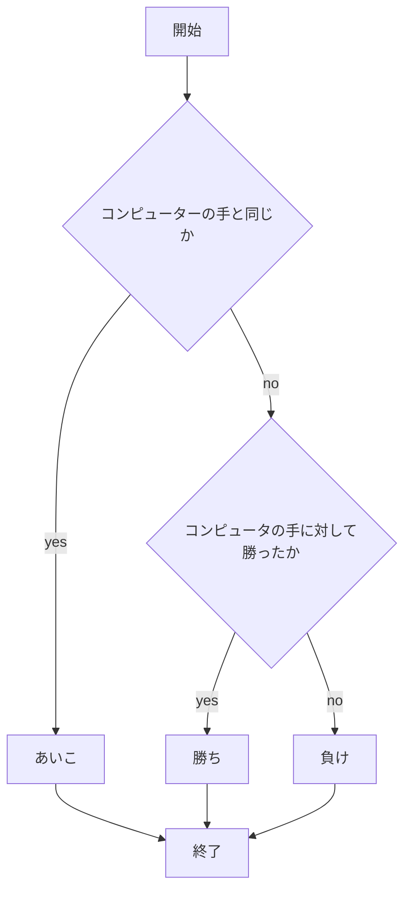
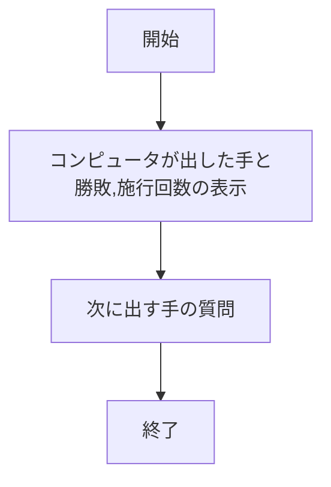
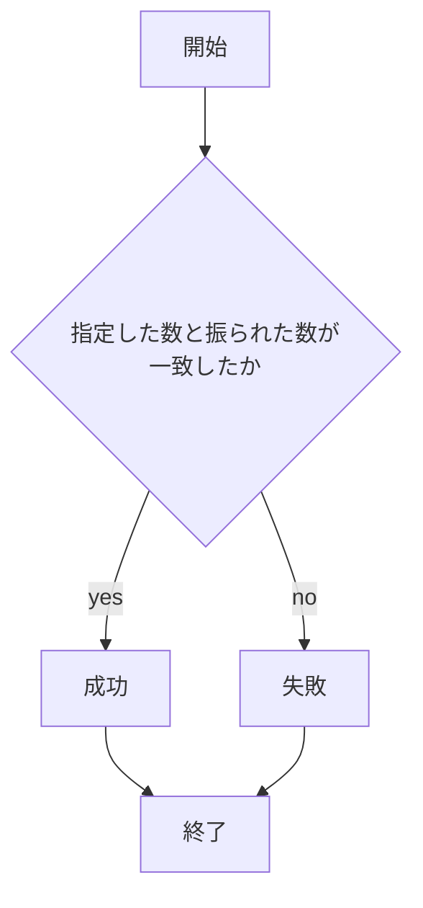
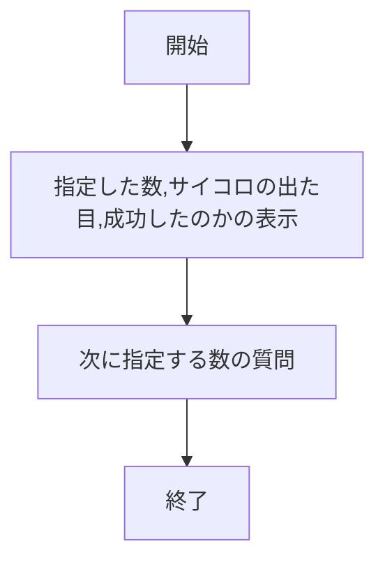
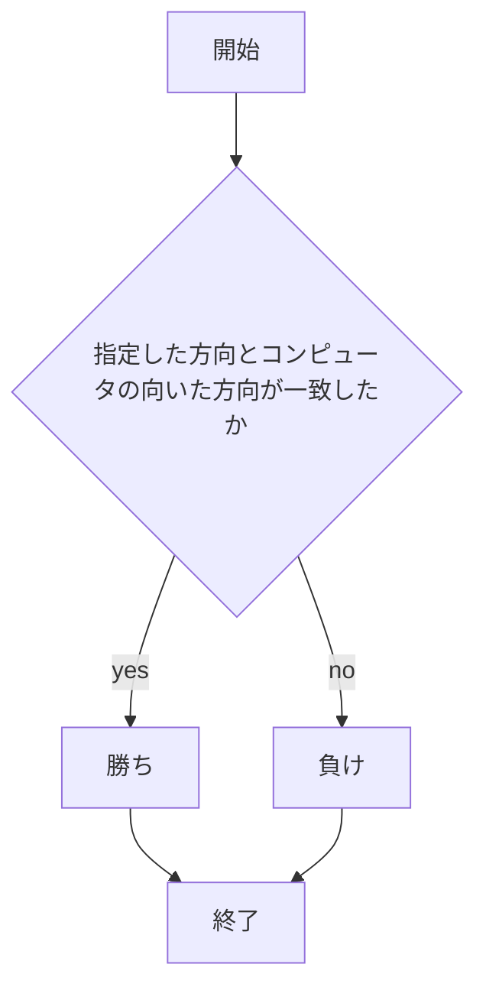
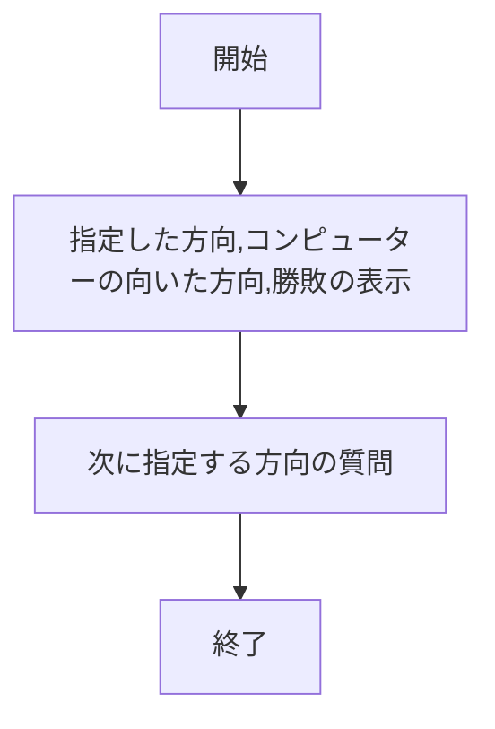

# webpro_06
2024_11_15

# プログラムについて
このプログラムは、複数のゲームと機能をWebブラウザで提供するものである。ゲームは、ユーザーが選択した手や方向に基づき、コンピュータと対戦する形式で進行する。結果はWebページ上で表示され、次の選択ができるようにフォームが表示される。

## ファイル一覧
| ファイル名 | 説明 |
| --- | --- |
| `app5.js` | プログラム本体。各種ゲームや機能を提供 |
| `public/janken.html` | じゃんけんゲームの開始画面 |
| `views/janken.ejs` | じゃんけんゲームの結果及び次の質問を表示する |
| `public/saikoro.html` | イカサマサイコロゲームの開始画面 |
| `views/saikoro.ejs` | イカサマサイコロゲームの結果及び次の質問を表示する |
| `public/facegame.html` | あっちむいてほいゲームの開始画面 |
| `views/facegame.ejs` | あっちむいてほいゲームの結果及び次の質問を表示する |
| `views/show.ejs` | 挨拶メッセージを表示する |
| `views/luck.ejs` | おみくじの結果を表示する |
| `views/icon.ejs` | 画像を表示する |

## 使用方法

1. **サーバーの起動**  
   `app5.js` を実行する。サーバーは、様々なページやゲーム機能を提供する。

2. **各ページのアクセス方法**  
   Webブラウザで以下のURLにアクセスして、各機能を利用できる：
   - `localhost:8080/public/hello1.html`: 2つの挨拶メッセージを表示
   - `localhost:8080/public/hello2.html`: 2つの挨拶メッセージを表示
   - `localhost:8080/public/icon.html`: どこぞのAppleのロゴ画像を表示
   - `localhost:8080/public/luck.html`: ランダムで決まるおみくじの運勢を表示
   - `localhost:8080/public/janken.html`: じゃんけんゲーム。ユーザーが手を選択し、コンピュータと対戦
   - `localhost:8080/public/saikoro.html`: サイコロゲーム。選んだ目と実際に出た目を比較してイカサマできたのか判定
   - `localhost:8080/public/facegame.html`: あっちむいてほいゲーム。方向を選んでコンピュータと対戦

3.**ゲームでの入力**
### 1. じゃんけんゲーム（`janken.ejs`）
自分の出す手をグー、チョキ、パーのうちから選んで入力する。

### ２. イカサマサイコロゲーム（`janken.ejs`）
自分が出したい数を選択肢から選んで送信する

### 3. あっちむいてほいゲーム（`facegame.ejs`）
上、下、右、左から自分が指したい方向を選択肢から選び送信する。

## 各機能の詳細

### 1. 挨拶メッセージ（`show.ejs`）
ユーザーに2つの挨拶メッセージを表示する。`/hello1` で表示されるメッセージは `"Hello world"` と `"Bon jour"` で、`/hello2` ではこれと同じ内容が表示される。

### 2. おみくじ（`luck.ejs`）
ユーザーの運勢をランダムに決定し表示する。運勢は「大吉」「中吉」などの形式で表示され、デバッグ用にランダムに生成された番号も表示される。

### 3. 画像表示（`icon.ejs`）
指定された画像ファイルと代替テキストを表示する。`/icon` にアクセスすることで、Appleのロゴ画像が表示される。

### 4. じゃんけんゲーム（`janken.ejs`）
ユーザーが手を選んで、コンピュータとじゃんけんを行い、その結果を表示する。ゲームの進行状況として、総試合数と勝利数が表示され、次に出す手を入力するフォームが提供される。

### 5. イカサマサイコロゲーム（`saikoro.ejs`）
ユーザーが指定した目をサイコロで出すことを試みる。サイコロの目はランダムに決まるが、確率操作がされているため指定した目と一致する確率が高くなっている。4,5,6サイコロではない。

### 6. あっちむいてほいゲーム（`facegame.ejs`）
ユーザーが選んだ方向に対して、コンピュータもランダムに方向を決め、その結果を判定する。ユーザーが指した方向とコンピュータが向いた方向が一致するかどうかで勝敗が決まる。

以下にそれぞれのゲームについての動的ファイルのフローチャートを示す。
## じゃんけんゲーム
### app5.js

### janken.ejs

## イカサマサイコロゲーム
### app5.js

### saikoro.ejs

## あっちむいてほいゲーム
### app5.js

### facegame.ejs

